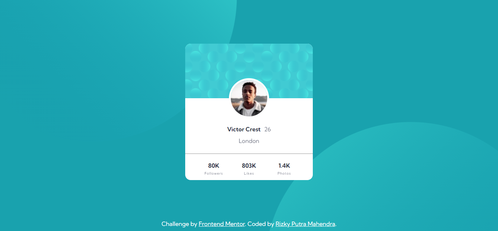
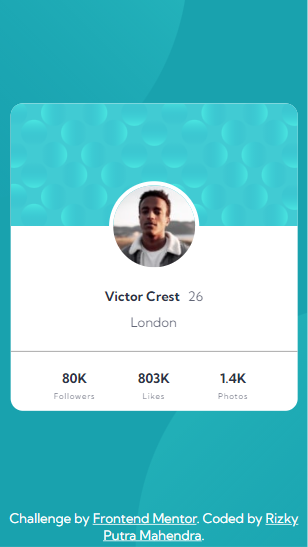

# Frontend Mentor - Profile card component solution

This is a solution to the [Profile card component challenge on Frontend Mentor](https://www.frontendmentor.io/challenges/profile-card-component-cfArpWshJ). Frontend Mentor challenges help you improve your coding skills by building realistic projects.

## Table of contents

-   [Overview](#overview)
    -   [The challenge](#the-challenge)
    -   [Screenshot](#screenshot)
    -   [Links](#links)
-   [My process](#my-process)
    -   [Built with](#built-with)
    -   [Useful resources](#useful-resources)
-   [Author](#author)

## Overview

### The challenge

-   Build out the project to the designs provided

### Screenshot

### Links

-   Solution URL: [Add solution URL here](https://your-solution-url.com)
-   Live Site URL: [Add live site URL here](https://your-live-site-url.com)

## My process

### Built with

-   Semantic HTML5 markup
-   Naming Block Element Modifier (BEM)
-   SCSS
-   Desktop-first workflow

### Useful resources

-   [YouTube - Coding Sections](https://youtu.be/vjObtWO5RvU) - I was stuck at positioning the circles for background, and this resource helped me how to do it.

## Author

-   Frontend Mentor - [@rizky-pm](https://www.frontendmentor.io/profile/rizky-pm)
-   Twitter - [@\_rizkypm](https://twitter.com/_rizkypm)
